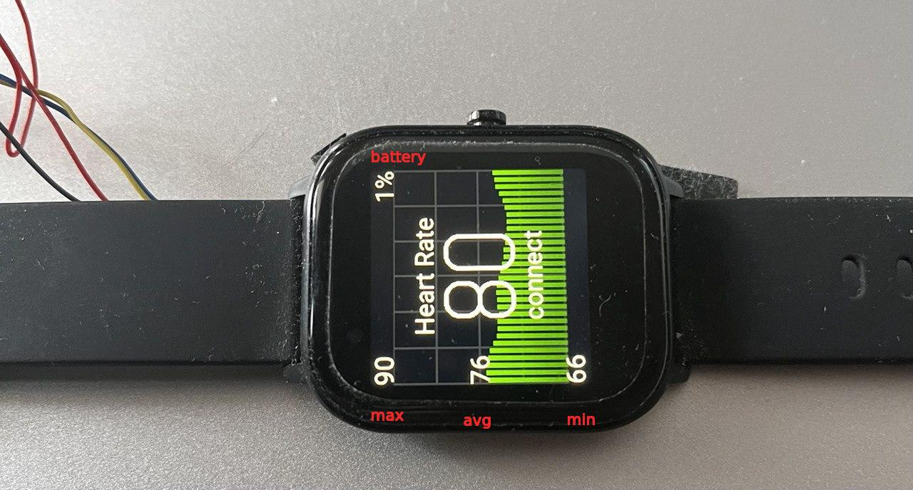
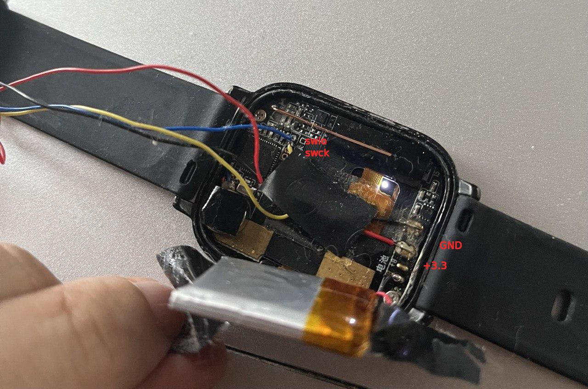

Colmi P8 Smartwatch with ANT+ HRM measurement for Platform IO

Based On ATCWatch https://github.com/atc1441/ATCwatch/tree/master/ATCwatch

## About

It's a proof of concept project which allow to use ANT+ connection with a body heart rate sensor.

swio(blue wire), swck(yellow wire) - ports on your segger g-link

## How to build project and flash your watch

Build Project in PIO and find bootloder:
./p8-smartwatch/packages/framework-arduinoadafruitnrf52/bootloader/feather_nrf52832/feather_nrf52832_bootloader-0.6.2_s132_6.1.1.hex

Flash bootloader using g-link(SEGGER JFlash Lite) with SoftDevice 6.1.1 (Don't forget to unlock nrf52)

Now you can upload software using PlatformIO

